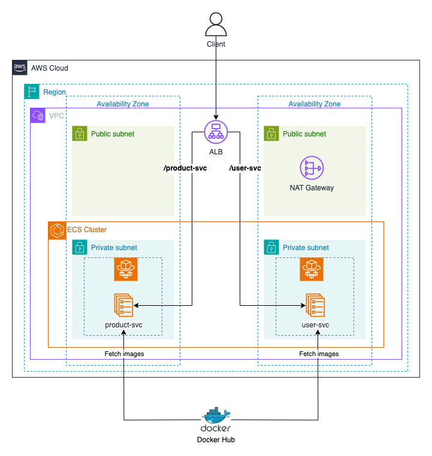

# Deploying multiple services on ECS with Fargate Challenge

## Overview

In this challenge, you will use Terraform to create an ECS cluster and deploy multiple services on it. The services will be running in a private subnet and will be accessed through an Application Load Balancer (ALB) placed in the public subnet.

## Tasks

Create an ECS cluster and deploy two services `product-svc` and `user-svc` on it. They are simple Node.JS API servers and have been dockerized and pushed to Docker Hub.

- `product-svc`:
  - Image: [phamtrongnghia1105/product-svc](https://hub.docker.com/r/phamtrongnghia1105/product-svc)
  - Port: 3000 (default). You can change it by setting the `PORT` environment variable.
  - Routes:

    - `GET /product-svc/products`: Get all products.
    - `GET /product-svc/products/{id}`: Get a product by ID.
    - `GET /product-svc/health`: Check the health of the service.

- `user-svc`:
  - Image: [phamtrongnghia1105/user-svc](https://hub.docker.com/r/phamtrongnghia1105/user-svc)
  - Port: 3000 (default). You can change it by setting the `PORT` environment variable.
  - Routes:
    - `GET /user-svc/users`: Get all users.
    - `GET /user-svc/users/{id}`: Get a user by ID.
    - `GET /user-svc/health`: Check the health of the service.

For more information, you can check the source code of the services in `resources` directory.

The services should be running in a private subnet. The ALB should be placed in the public subnet and should be able to route traffic to the services. Clients should be able to access the services through the ALB DNS name and the path of the service:

- `http://<ALB_DNS_NAME>/product-svc/*`: Access the `product-svc`.
- `http://<ALB_DNS_NAME>/user-svc/*`: Access the `user-svc`.
