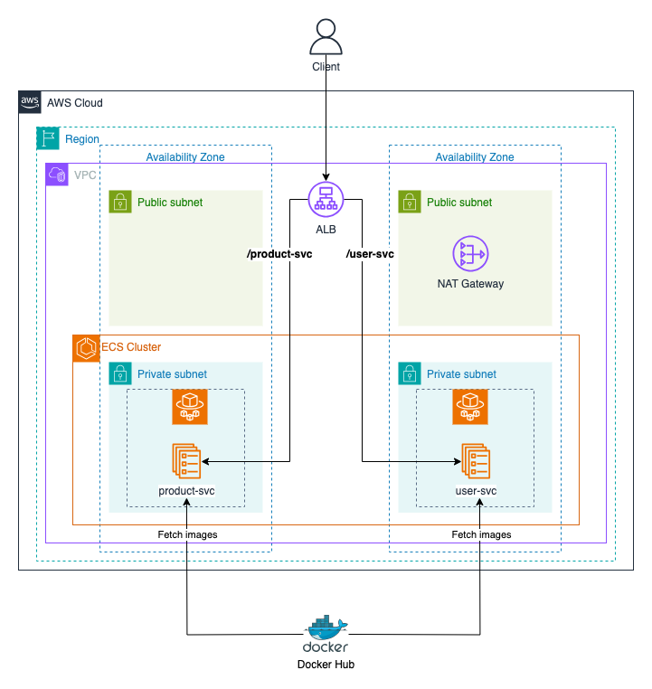

# [SOLUTION] Deploying multiple services on ECS with Fargate



## Prerequisites

- Docker installed on your local machine (https://docs.docker.com/get-docker/)
- AWS CLI installed and configured with the appropriate permissions (https://docs.aws.amazon.com/cli/latest/userguide/getting-started-install.html)
- Terraform installed on your local machine (https://learn.hashicorp.com/tutorials/terraform/install-cli)

## Step 1: Initialize Terraform project

In this step, we will initialize a Terraform project.

First, create a new directory and create a `main.tf` to specifiy the AWS provider and the region where the resources will be created.

`main.tf`:

```hcl
provider "aws" {
  region = var.region
}
```

Next, we create a file `variables.tf` to define the input variables. In this case, we define the `region` variable with a default value of `us-east-1`. Feel free to change the default value to your preferred region.

`variables.tf`:

```hcl
variable "region" {
  description = "The AWS region"
  default     = "us-east-1"
}
```

Initialize the Terraform project by running the following command:

```bash
terraform init
```

## Step 2: Create a VPC

In this step, we will create a VPC where the ECS cluster and other resources will be deployed.

Add new variable `azs` to the `variables.tf` file to specify the availability zones for the VPC. In this case, we will use `["us-east-1a", "us-east-1b"]` as the default value. Feel free to change it to match your chosen region.

`variables.tf`:

```hcl
variable "azs" {
  description = "The Availability Zones"
  default     = ["us-east-1a", "us-east-1b"]
}
```

Defining a VPC and its associated resources can be complex and error-prone so we will use the [terraform-aws-modules/vpc/aws](https://registry.terraform.io/modules/terraform-aws-modules/vpc/aws/latest) module to simplify the process. Create a file `vpc.tf` and define a `vpc` module.

`vpc.tf`:

```hcl
locals {
  vpc_cidr        = "10.0.0.0/16"
  public_subnets  = ["10.0.0.0/24", "10.0.1.0/24"]
  private_subnets = ["10.0.2.0/24", "10.0.3.0/24"]
}

module "vpc" {
  source             = "terraform-aws-modules/vpc/aws"
  name               = "ecs-vpc"
  azs                = var.azs
  cidr               = local.vpc_cidr
  public_subnets     = local.public_subnets
  private_subnets    = local.private_subnets
  enable_nat_gateway = true
  single_nat_gateway = true
}

resource "aws_security_group" "public_sg" {
  vpc_id = module.vpc.vpc_id
  name   = "public-sg"
  ingress = [
    {
      from_port        = 80
      to_port          = 80
      protocol         = "tcp"
      cidr_blocks      = ["0.0.0.0/0"]
      description      = "Allow HTTP inbound traffic"
      ipv6_cidr_blocks = []
      security_groups  = []
      prefix_list_ids  = []
      self             = false
    }
  ]
  egress = [
    {
      from_port        = 0
      to_port          = 0
      protocol         = "-1"
      cidr_blocks      = ["0.0.0.0/0"]
      description      = "Allow all outbound traffic"
      ipv6_cidr_blocks = []
      prefix_list_ids  = []
      security_groups  = []
      self             = false
    }
  ]
}

resource "aws_security_group" "private_sg" {
  vpc_id = module.vpc.vpc_id
  name   = "private-sg"
  ingress = [
    {
      from_port        = 0
      to_port          = 0
      protocol         = "-1"
      cidr_blocks      = ["0.0.0.0/0"],
      description      = "Allow all inbound traffic from the public subnet"
      security_groups  = [aws_security_group.public_sg.id]
      ipv6_cidr_blocks = []
      prefix_list_ids  = []
      security_groups  = []
      self             = false
    }
  ]
  egress = [
    {
      from_port        = 0
      to_port          = 0
      protocol         = "-1"
      cidr_blocks      = ["0.0.0.0/0"]
      description      = "Allow all outbound traffic"
      security_groups  = []
      ipv6_cidr_blocks = []
      prefix_list_ids  = []
      security_groups  = []
      self             = false
    }
  ]
}
```

- A VPC with a CIDR block of `10.0.0.0/16` will be created.
- Two public subnets with CIDR blocks `10.0.0.0/24`, `10.0.1.0/24` will be used for deploying internet-facing resources like Elastic Load Balancer (ELB) and NAT Gateway.
- Two private subnets with CIDR blocks `10.0.2.0/24` and `10.0.3.0/24` will be used for deploying ECS Fargate tasks.
- NAT Gateway will also be created to allow private subnets to access the internet, specifically for pulling Docker images from Docker Hub in this case.
- The `public_sg` allows inbound traffic on port 80 from the internet while the `private_sg` allows all inbound traffic from the public subnets. Both security groups allow all outbound traffic.

Apply the changes to create the VPC and its associated resources:

```bash
terraform init
terraform apply
```

## Step 3: Create an Execution Role for ECS Tasks

The ECS tasks requires an execution role to do things like pull the Docker images from the Container Registry (ECR, Docker Hub) or write logs to CloudWatch.

Create `iam.tf` file and define an IAM role. The role will have a
managed policy `AmazonECSTaskExecutionRolePolicy` attached to it which grants the necessary permissions for ECS tasks.

`iam.tf`:

```hcl
resource "aws_iam_role" "ecs_task_execution_role" {
  name = "ecs-task-execution-role"
  assume_role_policy = jsonencode({
    Version = "2012-10-17",
    Statement = [{
      Effect    = "Allow",
      Principal = {
        Service = "ecs-tasks.amazonaws.com"
      },
      Action    = "sts:AssumeRole"
    }]
  })
}

resource "aws_iam_role_policy_attachment" "ecs_task_execution_role_policy" {
  role       = aws_iam_role.ecs_task_execution_role.name
  policy_arn = "arn:aws:iam::aws:policy/service-role/AmazonECSTaskExecutionRolePolicy"
}
```

Apply the changes to create the IAM role:

```bash
terraform apply
```

## Step 4: Create ECS Fargate Cluster, Task Definition and Service

In this step, we will create an ECS cluster and run two services `product-svc` and `user-svc` in it. The services will be running in the ECS Fargate launch type.

Create a file `ecs.tf` and define the necessary resources:

`ecs.tf`:

```hcl
resource "aws_ecs_cluster" "ecs_cluster" {
  name = "ecs-cluster"
}

resource "aws_ecs_task_definition" "product_svc_task_def" {
  family = "product-svc-td"
  container_definitions = jsonencode([{
    name      = "product-svc"
    image     = "phamtrongnghia1105/product-svc"
    essential = true
    portMappings = [{
      containerPort = 3000
      hostPort      = 3000
    }]
  }])
  requires_compatibilities = ["FARGATE"]
  network_mode             = "awsvpc"
  execution_role_arn       = aws_iam_role.ecs_task_execution_role.arn
  cpu                      = 256
  memory                   = 1024
}

resource "aws_ecs_task_definition" "user_svc_task_def" {
  family = "user-svc-td"
  container_definitions = jsonencode([{
    name      = "user-svc"
    image     = "phamtrongnghia1105/user-svc"
    essential = true
    portMappings = [{
      containerPort = 3000
      hostPort      = 3000
    }]
  }])
  requires_compatibilities = ["FARGATE"]
  network_mode             = "awsvpc"
  execution_role_arn       = aws_iam_role.ecs_task_execution_role.arn
  cpu                      = 256
  memory                   = 1024
}

resource "aws_ecs_service" "product_svc" {
  name            = "product-svc"
  cluster         = aws_ecs_cluster.ecs_cluster.arn
  task_definition = aws_ecs_task_definition.product_svc_task_def.arn
  desired_count   = 2
  launch_type     = "FARGATE"
  network_configuration {
    subnets         = module.vpc.private_subnets
    security_groups = [aws_security_group.private_sg.id]
  }
  availability_zone_rebalancing = "ENABLED"
}

resource "aws_ecs_service" "user_svc" {
  name            = "user-svc"
  cluster         = aws_ecs_cluster.ecs_cluster.arn
  task_definition = aws_ecs_task_definition.user_svc_task_def.arn
  desired_count   = 2
  launch_type     = "FARGATE"
  network_configuration {
    subnets         = module.vpc.private_subnets
    security_groups = [aws_security_group.private_sg.id]
  }
  availability_zone_rebalancing = "ENABLED"
}
```

We define an ECS cluster named `ecs-cluster`, two task definitions `product-svc-td`, `user-svc-td`, and two services `product-svc`, `user-svc`.

The task definitions specify:

- The Docker images to run: `phamtrongnghia1105/product-svc` and `phamtrongnghia1105/user-svc`.
- The required CPU and memory: `256` CPU units and `1024` MiB of memory. They are enough for testing purposes.
- The network mode: `awsvpc`, which is the only supported mode for Fargate tasks. Each task gets its own elastic network interface (ENI) and a private IP address.
- The execution role we created earlier.
- The compatibility mode: `FARGATE`, which specifies that the task should run on Fargate.

The services specify:

- The desired number of tasks to run: `2`. Later we will see that ALB will distribute the incoming traffic to these tasks evenly.
- The launch type: `FARGATE`, of course!
- The network configuration, which specifies that the tasks should be run in the private subnets and use the `private_sg` security group. This ensures that the tasks are not directly accessible from the internet. Their incoming traffic will be routed through the Application Load Balancer (ALB) while the outgoing traffic will be routed through the NAT Gateway.

Apply the changes:

```bash
terraform apply
```

After the resources have been created successfully, you can check the ECS cluster, task definition, and service on the [AWS Management Console](https://console.aws.amazon.com/ecs/home) or AWS CLI. It may take a few minutes for the service to be fully deployed and running.

## Step 5: Create an Application Load Balancer (ALB)

At this point, you still cannot access the services because they are not directly exposed to the internet. To allow external access, we will create an Application Load Balancer (ALB) that will distribute incoming traffic to the ECS service tasks.

Create a file `alb.tf` and define the ALB and its associated resources:

`alb.tf`:

```hcl
resource "aws_alb" "alb" {
  name            = "ecs-alb"
  subnets         = module.vpc.public_subnets
  security_groups = [aws_security_group.public_sg.id]
}

resource "aws_alb_target_group" "product_svc_tg" {
  name        = "product-svc-tg"
  port        = 3000
  protocol    = "HTTP"
  vpc_id      = module.vpc.vpc_id
  target_type = "ip"
  health_check {
    protocol            = "HTTP"
    port                = 3000
    path                = "/health"
    interval            = 10
    healthy_threshold   = 3
    unhealthy_threshold = 2
    timeout             = 5
  }
}

resource "aws_alb_target_group" "user_svc_tg" {
  name        = "user-svc-tg"
  port        = 3000
  protocol    = "HTTP"
  vpc_id      = module.vpc.vpc_id
  target_type = "ip"
  health_check {
    protocol            = "HTTP"
    port                = 3000
    path                = "/health"
    interval            = 10
    healthy_threshold   = 3
    unhealthy_threshold = 2
    timeout             = 5
  }
}

resource "aws_alb_listener" "alb_listener" {
  load_balancer_arn = aws_alb.alb.arn
  port              = 80
  protocol          = "HTTP"
  default_action {
    type = "fixed-response"
    fixed_response {
      content_type = "text/plain"
      message_body = "Not Found"
      status_code  = "404"
    }
  }
}

resource "aws_alb_listener_rule" "product_svc_rule" {
  listener_arn = aws_alb_listener.alb_listener.arn
  action {
    type             = "forward"
    target_group_arn = aws_alb_target_group.product_svc_tg.arn
  }
  condition {
    path_pattern {
      values = ["/product-svc*"]
    }
  }
}

resource "aws_alb_listener_rule" "user_svc_rule" {
  listener_arn = aws_alb_listener.alb_listener.arn
  action {
    type             = "forward"
    target_group_arn = aws_alb_target_group.user_svc_tg.arn
  }
  condition {
    path_pattern {
      values = ["/user-svc*"]
    }
  }
}
```

We define an ALB named `ecs-alb`, two target groups corresponding to the `product-svc` and `user-svc` services, a listener that forwards incoming traffic on port 80.

The ALB is associated with the public subnets and the `public_sg` security group to able to receive incoming traffic from the internet.

The target groups use the `ip` target type to route traffic to the ECS service tasks based on their private IP addresses (since they are running in Fargate). The health check configuration specifies that the ALB should check the health of the service tasks by sending an HTTP request to the path `/health` every 10 seconds on port 3000. If the task does not respond correctly after 2 consecutive failures, it will be marked as unhealthy. Conversely, if it responds correctly after 3 consecutive checks, it will be marked as healthy.

We add two listener rules to forward incoming traffic to the target groups based on the path pattern. The first rule forwards traffic to the `product-svc-tg` target group if the path starts with `/product-svc`, and the second rule forwards traffic to the `user-svc-tg` target group if the path starts with `/user-svc`.

Next, we must update the ECS services to use the target groups we created. Open the `ecs.tf` file and add the `load_balancer` blocks to the `ecs_svc` resource:

`ecs.tf`:

```hcl
resource "aws_ecs_service" "user_svc" {
  ...
  + load_balancer {
  +   target_group_arn = aws_alb_target_group.user_svc_tg.arn
  +   container_name   = "user-svc"
  +   container_port   = 3000
  + }
}

resource "aws_ecs_service" "product_svc" {
  ...
  + load_balancer {
  +   target_group_arn = aws_alb_target_group.product_svc_tg.arn
  +   container_name   = "product-svc"
  +   container_port   = 3000
  + }
}
```

The `load_balancer` block specifies that the ECS services should be registered with the target groups we created earlier.

Finally, you can optionally add an output to display the DNS name of the ALB to use later so we you needn't to check it manually in the AWS Management Console. Create and add the following code to the `outputs.tf` file:

`outputs.tf`:

```hcl
output "alb_dns_name" {
  value = aws_alb.alb.dns_name
}
```

Apply the changes to create the ALB and update the ECS service:

```bash
terraform apply
```

## Step 6: Access the Web Server

After the resources have been created successfully, you can access the web server running in the ECS Fargate service through the ALB DNS name.
Open a web browser and enter the ALB DNS name you obtained from the above step, like `ecs-alb-1234567890.us-east-1.elb.amazonaws.com`. You should see a simple HTML page that says Hello along with the container's hostname. If you refresh the page multiple times, you will see that the hostname changes, indicating that the requests are being distributed among the ECS service tasks.

> Note: Don't put `https://` in front of the ALB DNS name because we are using HTTP, not HTTPS. We need to configure SSL/TLS certificates for the ALB to use HTTPS, which is out of the scope of this challenge.

## Step 7: Clean Up

After you have completed the challenge, make sure to clean up the resources to avoid incurring unnecessary costs.

Run the following command to destroy all the resources created by Terraform:

```bash
terraform destroy
```

You will be prompted to confirm the destruction of the resources. Type `yes` to proceed.

## Conclusion

We have successfully deployed a simple web server on ECS Fargate and exposed it to the internet using an Application Load Balancer. This setup allows the web server to scale horizontally by distributing incoming traffic among multiple ECS tasks. It also makes the ECS cluster more secure by preventing direct access to the tasks from the internet.
