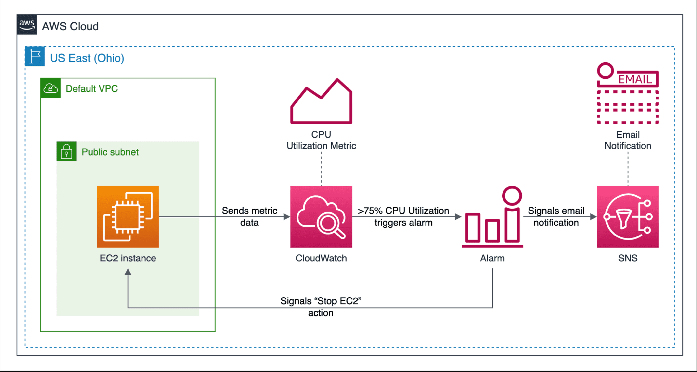

# Monitoring EC2 Instances using AWS CloudWatch

> Source: [Educative.io](https://www.educative.io)

## Overview

In this challenge, you are required to create a Terraform project to create an EC2 instance and a CloudWatch alarm that will monitor the CPU utilization metric of that instance. You’ll also set up an SNS topic and subscribe with your email address. You’ll then stress the EC2 instance to trigger the alarm, which will perform two actions. First, it will stop the instance, and then it will signal an SNS email notification to your email address.

## Tasks
1. Create an EC2 instance in a public subnet with any instance type you prefer. The instance should have a security group that allows inbound traffic on port 22 (SSH) and port 80 (HTTP) from anywhere. You can use the Amazon Linux 2 AMI for the instance.

2. Create a CloudWatch alarm that will monitor the CPU utilization metric of the EC2 instance. The alarm should trigger when the average CPU utilization is greater than 80% for 1 minute.

3. Create an SNS topic and subscribe with your email address. You can use the AWS Management Console to confirm the subscription.

4. Stress the EC2 instance to trigger the CloudWatch alarm. You can use any method to stress the instance, such as running a stress test tool (e.g., **stress**, **stress-ng**) or a simple script that consumes CPU.

5. Once the alarm is triggered, it should perform two actions:
    - Stop the EC2 instance.
    - Send an SNS email notification to your email address.
