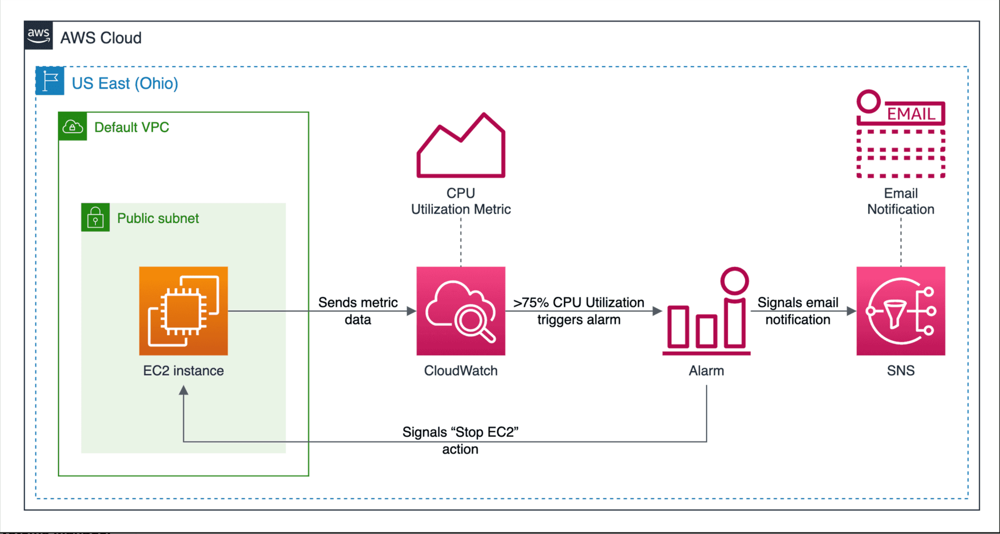
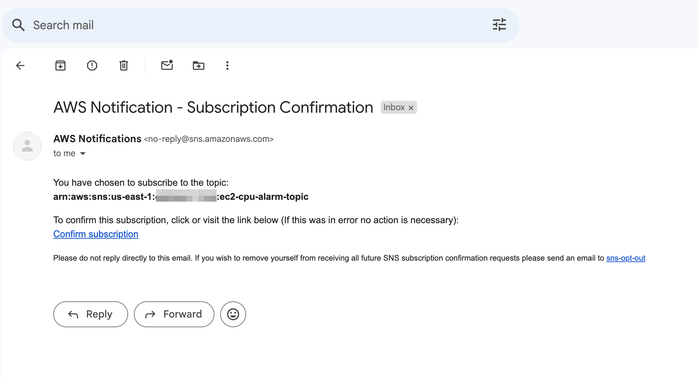
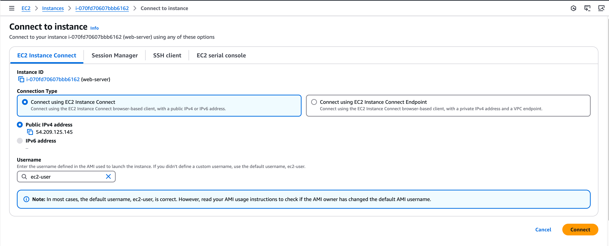
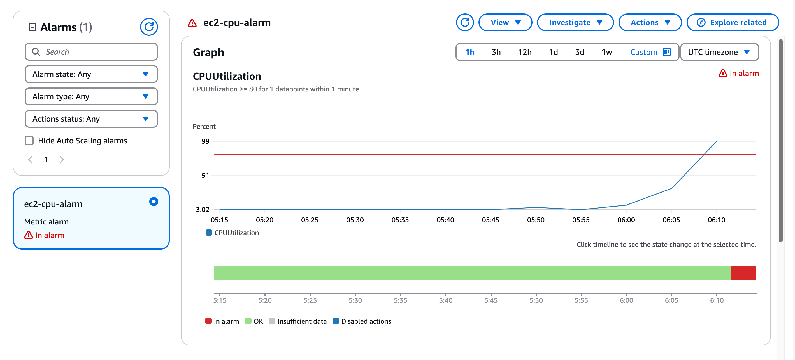
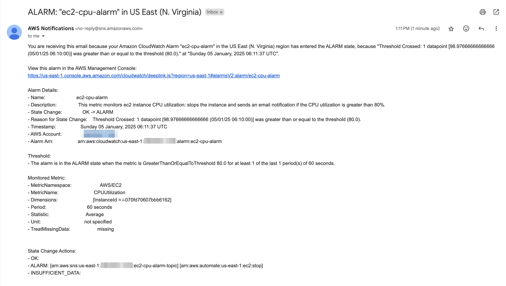

# [SOLUTION] Monitoring EC2 Instances Using AWS CloudWatch



## Prerequisites

- Docker installed on your local machine (https://docs.docker.com/get-docker/)
- AWS CLI installed and configured with the appropriate permissions (https://docs.aws.amazon.com/cli/latest/userguide/getting-started-install.html)
- Terraform installed on your local machine (https://learn.hashicorp.com/tutorials/terraform/install-cli)

## Step 1: Initialize Terraform project

In this step, we will initialize a Terraform project.

First, create a new directory and create a `main.tf` to specifiy the AWS provider and the region where the resources will be created.

`main.tf`:

```hcl
provider "aws" {
  region = var.region
}

data "aws_region" "current" {} # To get the current region
```

Next, we create a file `variables.tf` to define the input variables. In this case, we define the `region` variable with a default value of `us-east-1`. Feel free to change the default value to your preferred region.

`variables.tf`:

```hcl
variable "region" {
  description = "The AWS region"
  default     = "us-east-1"
}
```

Initialize the Terraform project by running the following command:

```bash
terraform init
```

## Step 2: Create a VPC

In this step, we will create a VPC where the EC2 instance and other resources will be deployed.

Add new variable `azs` to the `variables.tf` file to specify the availability zones for the VPC. In this case, we will use `["us-east-1a"]` as the default value, only one availability zone.

`variables.tf`:

```hcl
variable "azs" {
  description = "The Availability Zones"
  default     = ["us-east-1a"]
}
```

Defining a VPC and its associated resources can be complex and error-prone so we will use the [terraform-aws-modules/vpc/aws](https://registry.terraform.io/modules/terraform-aws-modules/vpc/aws/latest) module to simplify the process. Create a file `vpc.tf` and define the VPC module with the necessary configurations.

`vpc.tf`:

```hcl
locals {
  vpc_cidr       = "10.0.0.0/16"
  public_subnets = ["10.0.0.0/24"]
}

module "vpc" {
  source         = "terraform-aws-modules/vpc/aws"
  name           = "vpc"
  azs            = var.azs
  cidr           = local.vpc_cidr
  public_subnets = local.public_subnets

  default_security_group_ingress = [
    {
      from_port   = 80
      to_port     = 80
      protocol    = "tcp"
      cidr_blocks = "0.0.0.0/0"
      description = "Allow HTTP inbound traffic"
    },
    {
      from_port   = 22
      to_port     = 22
      protocol    = "tcp"
      cidr_blocks = "0.0.0.0/0"
      description = "Allow SSH inbound traffic from my IP"
    }
  ]

  default_security_group_egress = [
    {
      from_port   = 0
      to_port     = 0
      protocol    = "-1"
      cidr_blocks = "0.0.0.0/0"
      description = "Allow all outbound traffic"
    }
  ]
}
```

We define a VPC with these configurations:
- VPC CIDR block: `10.0.0.0/16`.
- One public subnet with CIDR block `10.0.0.0/24`.
- The default security group: 
  - Allows inbound traffic on port 80 from the internet.
  - Allows inbound SSH traffic on port 22 from the internet. 
    > Note: In the real world, it is recommended to restrict SSH access to a specific IP address or range of IP addresses to enhance security. However, for the purpose of this challenge, we allow SSH access from anywhere (`0.0.0.0/0`) to avoid issues related to IP changes in your network that could prevent you from accessing the instance later.
  - Allows all outbound traffic.

Apply the changes to create the VPC and its associated resources:

```bash
terraform init
terraform apply
```

## Step 3: Create an EC2 Instance
In this step, we will create an EC2 instance in the public subnet of the VPC.

Create a file `ec2.tf` and define the EC2 instance resource with the necessary configurations.

`ec2.tf`:

```hcl
data "aws_ami" "ami" {
  most_recent = true
  owners      = ["amazon"]
  filter {
    name   = "name"
    values = ["amzn2-ami-hvm-*"]
  }
}

resource "aws_instance" "instance" {
  ami           = data.aws_ami.ami.id
  instance_type = "t2.micro"
  subnet_id     = module.vpc.public_subnets[0]
  user_data     = <<-EOF
    #!/bin/bash
    yum update -y
    amazon-linux-extras install epel -y
    yum install -y httpd stress
    systemctl start httpd
    systemctl enable httpd
    echo "<h1>Hello, World!</h1>" > /var/www/html/index.html
    EOF

  associate_public_ip_address = true
  tags = {
    Name = "web-server"
  }
}
```

We define an EC2 instance with these configurations:
- The Amazon Linux 2 AMI. We use the `aws_ami` data source to get the latest Amazon Linux 2 AMI.
- Instance type: `t2.micro`, it is eligible for the AWS Free Tier.
- Subnet ID: The public subnet ID of the VPC.
- User data script to install Apache web server and the `stress` tool. The script also starts the Apache web server and creates a simple HTML file. We will use the `stress` tool to generate CPU load on the instance later.
- Associate a public IP address with the instance so that we can access the web server from the internet.

We can define an output to display the public IP address of the EC2 instance.
Create a file `outputs.tf` and define the output.

`outputs.tf`:

```hcl
output "instance_public_ip" {
  value = aws_instance.instance.public_ip
}
```

Apply the changes to create the EC2 instance:

```bash
terraform apply
```

After the EC2 instance is created, you can verify whether the Apache web server is running by opening the browser and navigating to the public IP address of the EC2 instance displayed in the output. If you see the **"Hello, World!"** message, the web server is running successfully.

## Step 4: Create SNS Topic
In this step, we will create an SNS topic that will be used to send notifications to an email address when the CPU utilization of the EC2 instance exceeds the threshold.

Create a file `sns.tf` and define the SNS topic resource with the necessary configurations.

`sns.tf`:

```hcl
resource "aws_sns_topic" "sns_topic" {
  name = "ec2-cpu-alarm-topic"
  
}

resource "aws_sns_topic_subscription" "subscription" {
  topic_arn = aws_sns_topic.sns_topic.arn
  protocol  = "email"
  endpoint  = var.notification_email
}
```

We define an SNS topic with the name `ec2-cpu-alarm-topic`. We also create an SNS topic subscription with the protocol `email` and the email address specified in the `notification_email` variable. 

Define the `notification_email` variable in the `variables.tf` file:

`variables.tf`:

```hcl
...
variable "notification_email" {
  description = "The email address that will receive the notifications"
}
```

Apply the changes to create the SNS topic and subscription:

```bash
terraform apply
```

You will be prompted to enter the email address that will receive the notifications. Enter the email address and type `yes` to confirm the creation of the resources.

> If you don't want to re-enter the value of `notification_email` variable every time you run `terraform apply`, you can set it a default value or use a `.tfvars` file to store the value.
 


You will receive an email from AWS SNS. To complete the subscription, click on the link in the email to confirm the subscription.

## Step 5: Create a CloudWatch Alarm
We will create a CloudWatch alarm to monitor the CPU utilization of the EC2 instance and trigger an alarm when the CPU utilization exceeds a certain threshold.

Create a file `cloudwatch.tf` and define the CloudWatch metric alarm resource with the necessary configurations.

`cloudwatch.tf`:

```hcl
resource "aws_cloudwatch_metric_alarm" "ec2_cpu_alarm" {
  namespace           = "AWS/EC2"
  metric_name         = "CPUUtilization"
  alarm_name          = "ec2-cpu-alarm"
  alarm_description   = "This metric monitors ec2 instance CPU utilization: stops the instance and sends an email notification if the CPU utilization is greater than 80%."
  comparison_operator = "GreaterThanOrEqualToThreshold"
  period              = 60
  evaluation_periods  = 1
  statistic           = "Average"
  threshold           = "80"
  dimensions = {
    InstanceId = aws_instance.instance.id
  }
  alarm_actions = [
    "arn:aws:automate:${data.aws_region.current.name}:ec2:stop",
    aws_sns_topic.sns_topic.arn
  ]
}
```

We define a CloudWatch alarm named `ec2-cpu-alarm` to monitor the `CPUUtilization` metric of the EC2 instance. The alarm will trigger when the average CPU utilization is greater than or equal to 80% for 1 minute. The alarm will perform two actions:
- Stop the EC2 instance.
- Send a notification to the SNS topic we created earlier that will be sent to the email address subscribed to the topic.

Apply the changes to create the CloudWatch alarm:

```bash
terraform apply
```

## Step 6: Stress the EC2 Instance
In this step, we will stress the EC2 instance to trigger the CloudWatch alarm. We will use the `stress` tool which has been installed on the EC2 instance to generate CPU load.



Access the EC2 service UI in the AWS Management Console, select the EC2 instance, click on the **Connect** button, choose EC2 Instance Connect as the connection method, and click on **Connect** to open a terminal session to the EC2 instance.

After connecting to the EC2 instance successfully, run the following command to stress the CPU:

```bash
stress --cpu 1 --timeout 300
```

This command will stress the CPU for 300 seconds. You can adjust the duration as needed.



After running the command, the CPU utilization of the EC2 instance will increase, and the CloudWatch alarm will trigger when the CPU utilization exceeds the threshold of 80%. You can verify this by checking the CloudWatch console and observing the alarm state. The process may take a few minutes to let the CloudWatch alarm evaluate the metric. 



You should receive an email notification from AWS SNS including the details of the alarm.

The EC2 instance will be also stopped automatically as a result of the alarm action. You can verify this by checking the EC2 instance status in the AWS Management Console.

## Step 7: Clean Up

After you have completed the challenge, make sure to clean up the resources to avoid incurring unnecessary costs.

Run the following command to destroy all the resources created by Terraform:

```bash
terraform destroy
```

You will be prompted to confirm the destruction of the resources. Type `yes` to proceed.

## Conclusion

In this challenge, you have successfully created an EC2 instance, set up a CloudWatch alarm to monitor the CPU utilization of the instance, and configured an SNS topic to send email notifications when the alarm is triggered. You have also tested the alarm by stressing the EC2 instance to trigger the alarm and observed the actions taken by the alarm.
