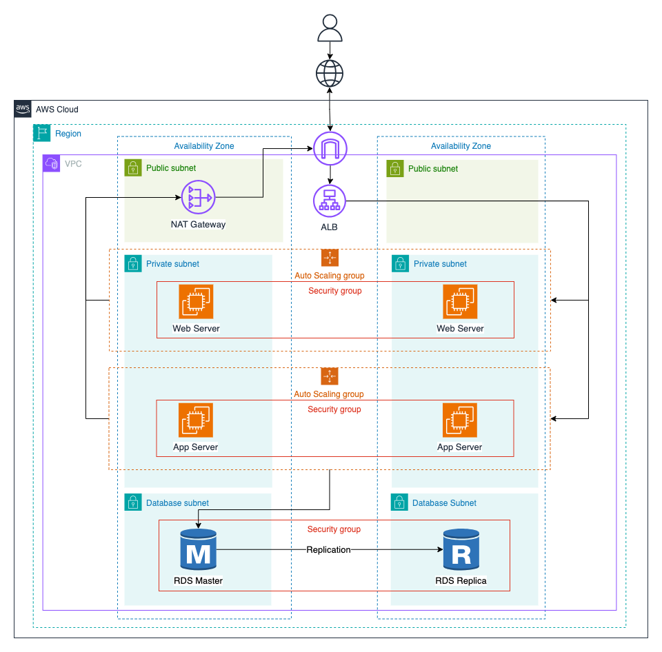

# Deploying AWS Multi-Tier Architecture 

## Overview
In this challenge, you will use Terraform to deploy a highly available, scalable, and secure multi-tier architecture on AWS using key services such as EC2, Auto Scaling Groups (ASGs), Elastic Load Balancers (ELBs), RDS, and VPC networking. 

## Architecture

The architecture consists of three tiers:
1. **Web Tier**: This tier is responsible for serving the web application to users.

2. **App Tier**: This tier is responsible for processing business logic and interacting with the database. The application servers communicate with the database tier to read and write data.

3. **Database Tier**: This tier is responsible for storing and managing the application's data. It consists of an RDS instance running a PostgreSQL database with Multi-AZ deployment for high availability and read replicas for scalability.

## Tasks
Your tasks are as follows:
### 1. Networking Setup
Create a custom VPC with the following:
- Public Subnets: For NAT Gateways, Elastic Load Balancers. These subnets should have internet access via an Internet Gateway.
- Private Subnets: for Frontend (Web servers) and Backend (App servers). These subnets should not have direct internet access, but they should have access to the internet through NAT Gateways.
- Database Subnets: For hosting the RDS instances and are isolated from the internet.   

### 2. Web Tier (Frontend)
- Create an Auto Scaling Group (ASG) for the web server instances and place them in the private subnets.
- Configure an Application Load Balancer (ALB) in the public subnets to distribute traffic to the web server instances.
- Use an Amazon Linux 2 AMI and install a web server (e.g., Apache or Nginx) which serves a SPA (Single Page Application) or a static website. A sample ReactJS project has been prepared for you in the `resources/frontend` directory, which you can use to deploy the frontend. Of course, you can use your own frontend project if you prefer.
- Security Groups:
    + ALB: Allow inbound HTTP/HTTPS traffic from anywhere.
    + Web server instances: Allow traffic only from the ALB's security group.

### 3. App Tier (Backend)
- Create an Auto Scaling Group (ASG) for the application server instances and place them in the private subnets.
- Configure the Application Load Balancer (ALB) to distribute traffic to the application server instances.
- Use an Amazon Linux 2 AMI and install an application server (e.g., Node.js or Flask). A sample Node.js project has been prepared for you in the `resources/backend` directory, which you can use to deploy the backend. You can also use your own backend project if you prefer.

- Security Groups:
    - App server instances: Allow traffic only from the ALB's security group.

### 4. Database Layer
Deploy an RDS database with the following:
- Use MySQL or PostgreSQL as the database engine.
- Enable Multi-AZ deployment for high availability.
- Configure read replicas for scalability.
- Place the RDS instance in the database subnets.
- Security Groups:
    - Allow traffic only from the backend layer to the RDS instance on the database port.

### 5. Testing

