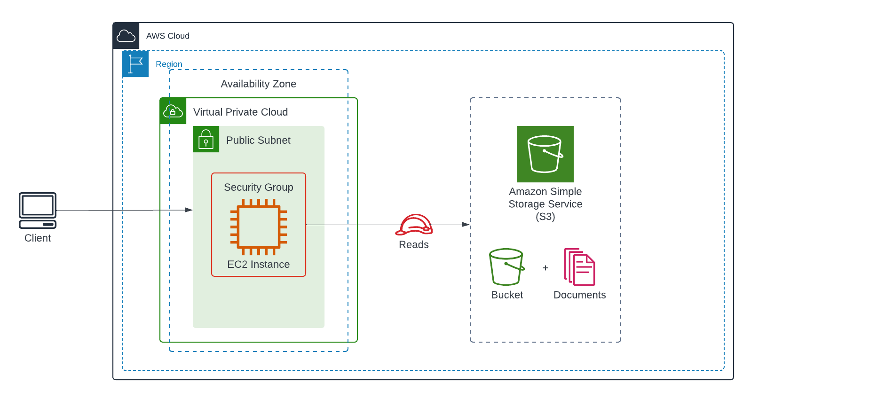

# S3 and EC2 Integration

## Problem
You are tasked with building an architecture that integrates an S3 bucket and an EC2 instance. The EC2 instance will fetch student data from a JSON file in the S3 bucket and serve it via a simple web server (e.g., Apache). The student data should be accessible via a web browser. 

## Requirements
Build a Terraform project that accomplishes the following:
1. Create an S3 bucket and upload the `students.json` file to it. The `students.json` is provided in the `resources` directory.
2. Create an EC2 instance with the following requirements:
    - The instance should be in a public subnet.
    - The instance should have a security group that allows inbound traffic on port 80.
    - The instance should have an IAM role that allows it to read the `students.json` file from the S3 bucket.
    - The instance should have a user data script that installs a web server (e.g., Apache). The web server should serve the `students.json` file at the root of the server.
3. Clients from the internet should be able to access the student data via the instance's address. For example, if the instance's public IP address is `54.227.128.160`, the student data should be accessible via `http://54.227.128.160/students.json`.

## Hints
- You can use the `aws_s3_object` resource to upload the `students.json` file to the S3 bucket.
- In the EC2 instance's user data script, you can install awscli and use the `aws s3 cp` command to download the `students.json` file from the S3 bucket and place it in the web server's root directory. Remember that the EC2 instance will need the appropriate IAM role to access the S3 bucket.

