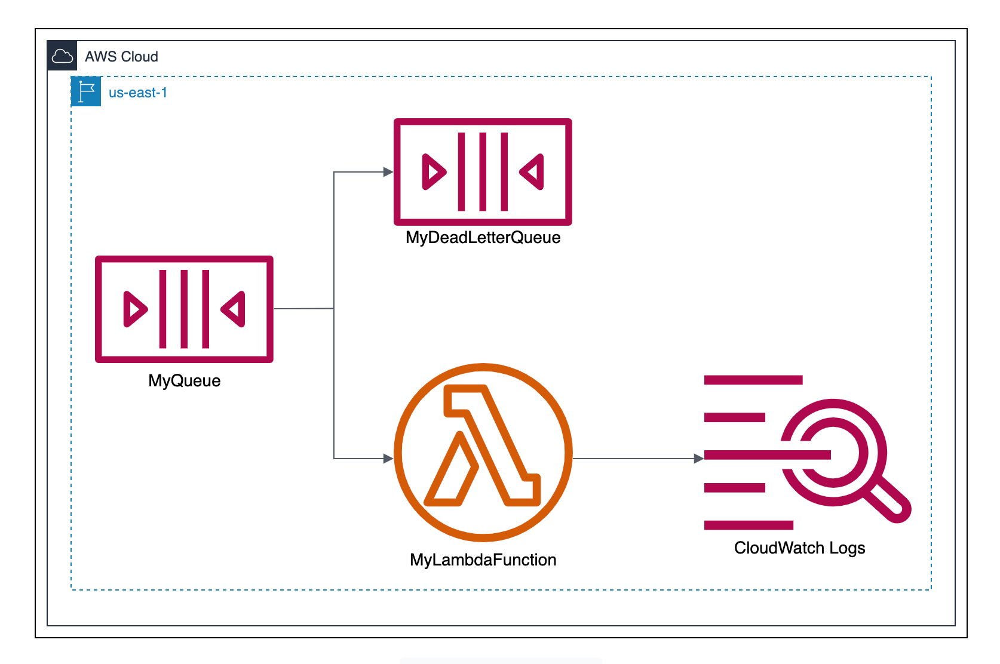

# Amazon Simple Queue Service (SQS) Dead-Letter Queue and Lambda

## Overview
Amazon Simple Queue Service (SQS) is a serverless messaging service for decoupling components in a system. In this challenge, you will create an SQS setup that includes a standard queue and a Dead-Letter Queue (DLQ). Messages sent to the standard queue will be processed by a Lambda function. You’ll simulate real-world scenarios such as message processing failures and configure the DLQ to store messages that fail to process after a certain number of attempts.

## Tasks
### 1. Setup the SQS Queues
- Create a standard SQS queue named MyQueue.
- Configure a Dead-Letter Queue (DLQ) named MyDeadLetterQueue to store messages that fail to process after a certain number of attempts.
- Set the Maximum Receive Count to 2 in the Redrive Policy. This means that a message will be moved to the DLQ after failing to process twice.

### 2. Create and Deploy a Lambda Function
Create a Lambda function called QueueProcessor that:
- Processes messages from MyQueue. The function should cover all possible scenarios, including successful processing and processing failures.
- Logs the received messages to Amazon CloudWatch Logs.
- Attach the SQS trigger to the Lambda function to automatically invoke it when a new message is added to MyQueue.
- Remember to grant the necessary permissions to the Lambda function to read messages from MyQueue and write logs to CloudWatch Logs.
> **Note:** If you don't want to write the Lambda function code from scratch, feel free to use the sample function provided in the `resources` folder.

### 3. Test the Setup
- Send a test message to MyQueue.
- Verify that the Lambda function processes the message and logs the message content to CloudWatch Logs.
- Send a test message that causes the Lambda function to fail processing (e.g., invalid message format, timeout, etc.).
- Verify that the message is moved to MyDeadLetterQueue after failing to process twice.
