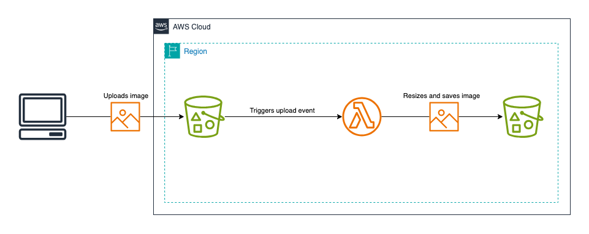

# Resizing S3 Images with Lambda Trigger

## Overview
In this challenge, you will create a Terraform project that sets up a flow for resizing images uploaded to an S3 bucket. The flow consists of an S3 bucket for storing original images, a Lambda function for resizing images, and another S3 bucket for storing resized images.

When an image is uploaded to the original images S3 bucket, the Lambda function is triggered. The Lambda function resizes the image to 3 different sizes: 100x100, 200x200, and 300x300 and uploads the resized images to the resized images S3 bucket.

## Tasks
Here are the tasks you need to complete for this challenge:
1. Create an S3 bucket for storing original images.
2. Create an S3 bucket for storing resized images.
3. Create a Lambda function that resizes images. Resize the image to 3 different sizes: 100x100, 200x200, and 300x300.
4. Configure the Lambda function to be triggered when an image is uploaded to the original images S3 bucket.
6. Test the flow by uploading an image to the original images S3 bucket and checking if the resized images are uploaded to the resized images S3 bucket.

## Hints
- The buckets and Lambda function must have proper permissions to interact with each other.