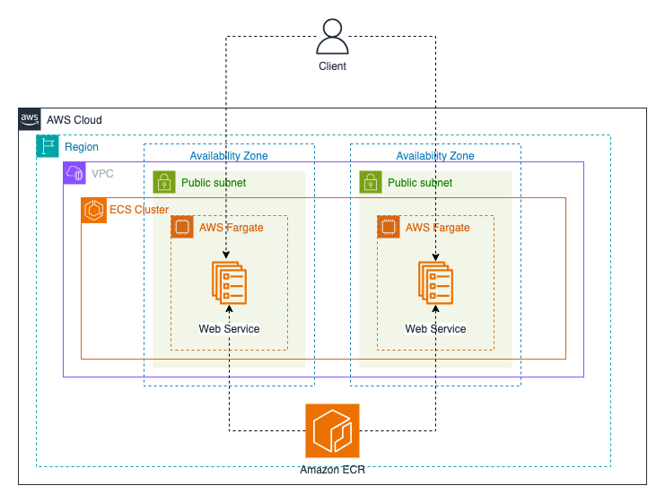

# Deploying a Simple Web Server on ECS with Fargate

## Overview
In this challenge, you will use Terraform to create an ECS cluster and deploy a simple web server that serves a static HTML page. Fargate will be used to run the web server.

## Tasks
1. Dockerize the web server to serve a static HTML page. You can use the sample HTML page provided in the `resources/index.html` directory. 
2. Create an ECR repository to store the Docker image and push the image to the repository.
3. Create an ECS cluster using Fargate.
4. Create an ECS task definition and service to run the web server. Note that they should be run in the public subnet so that the web server can be accessed from the internet.
5. Access the web server using the public IP addresses of the ECS service tasks.

