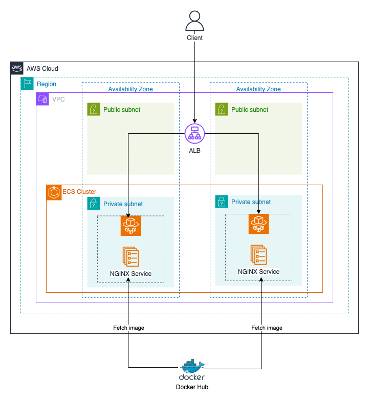

# Getting Started with ECS and ELB

## Overview
In this challenge, you will use Terraform to create an ECS cluster and deploy a simple NGINX web server on Fargate.
An Application Load Balancer (ALB) will be used to distribute incoming traffic to the ECS service tasks.

## Tasks
1. Create a **VPC**. The public subnets should have a route to the internet gateway, and the private subnets should have a route to the NAT gateway.
2. Create an **ECS cluster**, **Task definition** and **Service** to run a web server. For simplicity, you can use the [`phamtrongghia1105/hello-nginx`](https://hub.docker.com/r/phamtrongnghia1105/hello-nginx) Docker image published on Docker Hub. It is a simple NGINX web server that serves a static HTML page with the Hello message along with the container's hostname. The port used by the web server is 80. You can test it locally by running `docker run -p 8080:80 phamtrongnghia1105/hello-nginx` and accessing `http://localhost:8080` in your browser. 
    > **Note:** You can check the `resources/Dockerfile` to see how the Docker image is built.

4. Create an **Application Load Balancer (ALB)** to distribute incoming traffic to the ECS service tasks. The ALB should be placed in the public subnet and have a listener on port 80. The ALB should forward traffic to the NGINX web server running on the ECS service tasks.
5. Access the web server using the ALB's DNS name.
